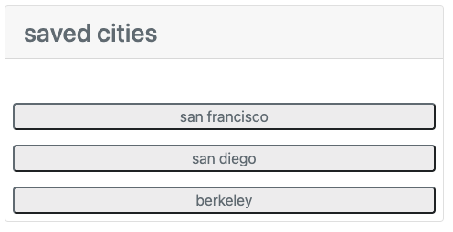
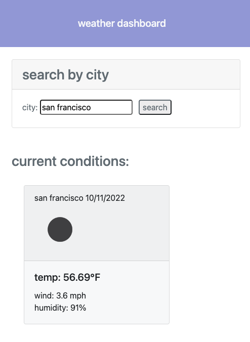

# Weather Dashboard


## Description:
This application uses a weather API, OpenWeather Map, to populate current and forecasted weather conditions. It allows users to search weather conditions by city, see the current and 5-day forecasted weather conditions, and click on previously searched cities to repopulate the forecast elements.






## Usage:
Users are intially presented with a form that searches for weather conditions by city. Once the form is submitted, the city will be saved as a button that can be clicked again to repopulate the forecast conditions with that city's specific data. Users can see the current date, temperature, wind speed, and humidity. They are also presented with an icon that represents the given conditions. 

```
var getCurrent = function(citySearch){
    var currentAPI = "https://api.openweathermap.org/data/2.5/weather?q=" + citySearch + "&appid=891d5adf6f627c8e1d4185e6ee80e104";
    fetch(currentAPI)
    .then(function(response){ 
    return response.json()})
    .then(function(data) {
});
};
getCurrent();
```

## Technologies Used:
* Github
* HTML
* CSS
* JavaScript
* JQuery
* OpenWeather Map API
* Web APIs
* Bootstrap.js
* VS Code

## License:
Please refer to the license in the repository


<!-- 
GIVEN a weather dashboard with form inputs : form to search city by name
WHEN I search for a city
THEN I am presented with current and future conditions for that city and that city is added to the search history

curent conditions : uses var weatherAPI to get the current weather conditions for that city : trim function, if there is a space replace it with a "+"
future conditions : uses var forecastAPI to get the 5 day weather conditions (probably 1200) : takes the long and lat values from the weatherAPI and concatonates them in the forecastAPI 
    weatherAPI : coord.lon, coord.lat
search history: button appended with city name as text value: clicking uses local storage to populate containers with weather details again

WHEN I view current weather conditions for that city
WHEN I view future weather conditions for that city
THEN I am presented with the city name, the date, an icon representation of weather conditions, the temperature, the humidity, and the wind speed
    Name
    Date
    Emoji representation: what are all of the possible values? ("main") and emojis for each (weather.icon)
https://openweathermap.org/img/wn/{weather.icon}@2x.png
    Temperature
    Humidity
    Wind speed


WHEN I click on a city in the search history
THEN I am again presented with current and future conditions for that city ; retrieve from local storage
 -->